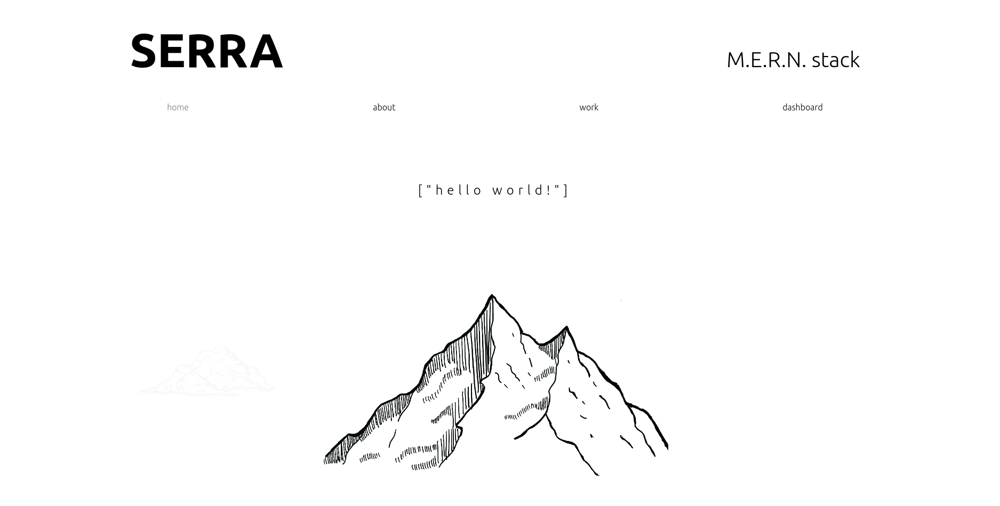
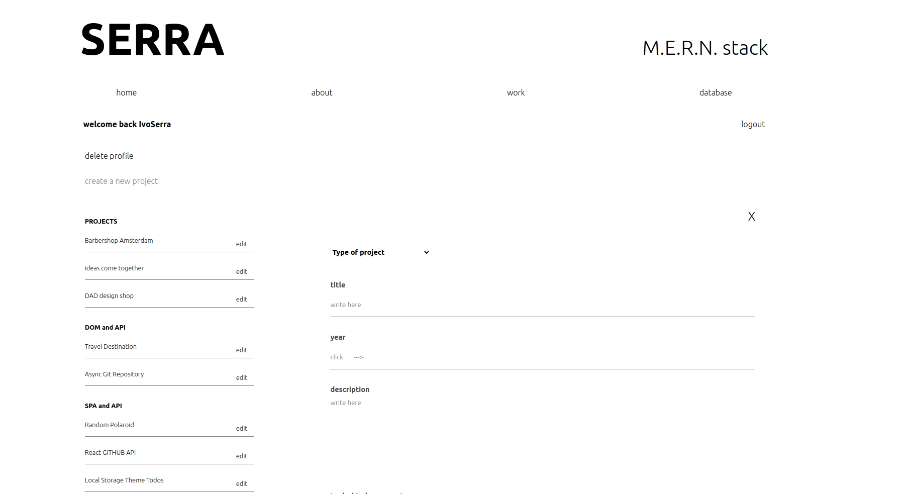

# * MERN STACK portfolio *

## Fullstack portfolio with its own database.

 

## Welcome to my portfolio. 

I designed this portfolio from the ground. Its an original idea, with my aesthetics and mood in relation to design in 2022. 
In my portfolio there is an about page, there you can know more about me, as a person and my journey to become a web-developer.

This portfolio was made with React and wants to showcase my projects and all the exercises I selected that I found the most relevant in my learning process.
Its a project that its responsive designed with SASS, and explores the Library React with Routes, props, costume user/data Contexts and animations.

One could say its mostly a project about fetching an API, but its an API that I created. 

Its also a project that approaches the portfolio with a Dashboard perspective that is only accessible in desktop.

I explore this theme on the next section after the next image.

 

### Dashboard : a cool product for a the owner of the portfolio.

## The Dashboard component idea. 
The Dashboard component is fully functional and updates and creates new data in the API.

Back in March/ April when I was creating my portfolio I thought about how cool that would be to have in the Browser a page where I could create new upcoming projects, update or delete the existing ones, making my Portfolio online constantly up-to-date without the need to write code for it. 
This idea came to instigate to learn more and a great excuse to learn more about backend, fetching, cors, sanitize,  dealing with errors, and to create error messages. The dashboard is functional , it was designed for the owner and later I had the idea to have implement logic for a visitor. 

Either I create or update a project, all its forms have an Image and Video component. For these components I used Firebase as a container for heavier files.

 

## Dashboard for visitors
As a visitor you can see what I designed and created. I build in the front end conditions that will not allow the visitor to create, delete or update a project. Your super welcome to visit, there is a simple and basic register form, (i only ask for a name and a password). Inside the dashboard component there is the option to delete your profile so its really easy.

## Backend
 I have build this backend in node, express, mongoDB, express-validators and schemas from mongoose. Its a simple Backend in my opinion.

 I decided not to apply cookies or authentication since for this specific project was not about security, since the product was designed for the owner of the portfolio only. 

 if you want to see the backend repository please click here.

 [ Ivo Serra github repository ](https://github.com/ivoserra/portfolioBackend)

 The backend was deployed on heroku. 

 if you have any further questions please contact me to : herrserra@icloud.com.

